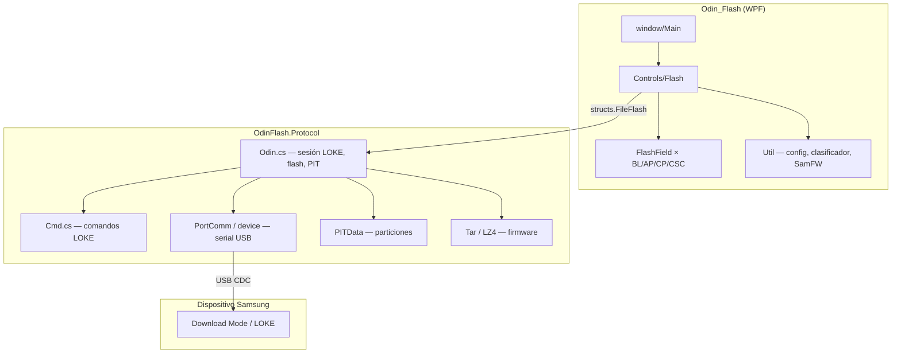

# Odin Flash

Herramienta de escritorio para flashear dispositivos **Samsung** en **Download Mode** mediante el protocolo **LOKE/Odin** sobre USB (CDC serial). Incluye interfaz WPF con Material Design 3, núcleo de protocolo reutilizable y pipeline de distribución (portable, ofuscación opcional e instalador Inno Setup).

**Versión actual:** 1.0.1 · **Runtime:** .NET Framework 4.8 · **Plataforma:** Windows 10/11 (x64)

---

## Validación en hardware

Probado con handshake LOKE, lectura DVIF y flash completo en varios perfiles Capa (Qualcomm, Exynos, MTK). Ejemplo de sesión exitosa (**SM-G770F**, Capa 128, ~9 GB):

```
Odin Flash 1.0.1
------------------------------------
Calculated Size : 9,052 GB
Model Number: SM-G770F
Capa Number: 128
vendor: SAMSUNG
Firmware Version: 0089
Build Number: G770FXXU6GVH6
Provision: PASS
```

| Modelo   | Capa | Notas |
|----------|------|-------|
| SM-G770F | 128  | Validado en campo (log anterior) |
| SM-A326B | 128  | Perfil Capa alto optimizado (~8 min / ~8,5 GB) |
| SM-G950F | 64   | Perfil legacy (paquetes 1 MiB) |

> **Aviso:** cada modelo y firmware puede comportarse distinto. Usa firmware correcto para tu variante (CSC, bit, binary). El flash puede borrar datos o dejar el dispositivo inutilizable.

---

## Requisitos

| Componente | Detalle |
|------------|---------|
| Sistema | Windows 10 u 11 (64 bits recomendado) |
| .NET | **.NET Framework 4.8** (incluido o instalable en Win10/11) |
| USB | Cable de datos; drivers Samsung / WinUSB según el equipo |
| Teléfono | Modo **Download** (combinación de botones + `adb reboot download` si aplica) |

---

## Arquitectura



### Capas del proyecto

| Capa | Ubicación | Responsabilidad |
|------|-----------|-----------------|
| **UI** | `window/`, `Controls/`, `Res/` | Ventana principal, slots BL/AP/CP/CSC, drag-and-drop, log, progreso, enlaces SamFW |
| **Utilidades** | `Util/` | Tunables LOKE (`LokePerformanceSettings`), conexión serial, clasificación de paquetes firmware |
| **Core** | `Lib/OdinFlash.Protocol/Library/` | Protocolo LOKE completo: handshake, init, PIT, plan de particiones, escritura NAND, tar/md5/lz4 |
| **Distribución** | `tools/` | Build, iconos, Obfuscar, Inno Setup |

El ejecutable embebe el protocolo con **Costura.Fody**; en desarrollo el core es una referencia de proyecto (`ProjectReference`).

---

## Flujo de un flash

1. **Usuario** carga firmware (`.tar` / `.tar.md5`) en BL, AP, CP y/o CSC, o arrastra un paquete clasificado automáticamente.
2. **UI** calcula el *Calculated Size* (total LOKE de slots habilitados) y muestra progreso en barra y log.
3. **Conexión:** búsqueda del puerto Download Mode (VID/PID Samsung), wake serial (DTR/RTS), magic `ODIN` → respuesta `LOKE`.
4. **DVIF:** lectura de información del dispositivo (modelo, Capa, build, provision, etc.).
5. **Perfil Capa:** `LokePerformanceSettings` ajusta tamaño de paquete NAND y delays según Capa (≥128 vs legacy).
6. **LOKE init** sin total → opcional **repartición PIT** → lectura PIT del teléfono.
7. **SetFlashTotal** una sola vez (evita doble `0x64/0x02` en variantes LOKE 4/5).
8. **BuildFlashPlan:** cruza archivos TAR con entradas PIT (matching flexible + preloader).
9. **FlashFirmware:** escritura por partición con ACK entre bloques; opciones Clear EFS / Boot update / Auto reboot.
10. **Fin:** log *All tasks completed* y tiempo transcurrido.

---

## El core (`OdinFlash.Protocol`)

Biblioteca C# que implementa el protocolo sin dependencia de WPF.

| Módulo | Archivo(s) | Función |
|--------|------------|---------|
| Sesión principal | `Odin.cs` | Handshake, `LOKE_Initialize`, `FlashFirmware`, `Read_Pit`, `Write_Pit`, progreso |
| Comandos | `Cmd.cs` | Buffer LOKE (`GetCmdBuff`), respuestas NAND |
| Puerto | `PortComm.cs`, `device.cs`, `OdinHandshakeProbe.cs` | SerialPort, semáforo, timeouts |
| PIT | `PITData.cs`, `TPIT_Entry.cs` | Desempaquetado y matching de particiones |
| Firmware | `util/Tar.cs`, LZ4 (K4os) | Extracción TAR, `.lz4` |
| Estructuras | `structs/` | `FileFlash`, `Result`, `ReadPitResult`, etc. |

Puntos de diseño relevantes:

- **Variantes LOKE 2–5** con secuencias `0x64` / `0x69` adaptadas.
- **Totales de sesión > 4 GiB** para paquetes grandes.
- **Alineación NAND** (paquetes fijos, zero-padding en el último bloque).
- **Tunables** expuestos al host vía propiedades estáticas (`FlashChunkBytes`, `NandPacketBytesWhenHighCapa`, etc.).

El core está pensado para reutilización futura (CLI, otro UI o paquete NuGet); la UI solo traduce `Util.FileFlash` → `structs.FileFlash` y suscribe eventos de log y progreso.

---

## Estructura del repositorio

```
Odin_Flash/
├── window/Main.xaml(.cs)      # Shell WPF, log, barra de título
├── Controls/                  # Flash + FlashField (slots firmware)
├── Util/                      # Config LOKE, serial, clasificador
├── Lib/OdinFlash.Protocol/    # Core LOKE/Odin
├── Assets/                    # source_icon.png, icon.ico
├── tools/
│   ├── Build-Production.ps1   # Build oficial + zip/installer
│   ├── Obfuscate-Publish.ps1  # Ofuscación del exe publicado
│   ├── Convert-PngToIcon.ps1  # Pipeline de iconos
│   ├── OdinFlash.iss          # Inno Setup
│   └── obfuscar.xml           # Plantilla Obfuscar
├── publish/                   # Salida (gitignored): release, zip, installer
├── App.config                 # Tunables LOKE y serial
└── Odin_Flash.sln
```

---

## Compilar y distribuir

### Requisitos de desarrollo

- Visual Studio 2022 (o Build Tools) con **.NET Framework 4.8**
- PowerShell 5.1+
- Opcional: **Inno Setup 6** (instalador)
- Opcional: **.NET SDK** (herramienta global Obfuscar vía `dotnet tool restore`)

### Build oficial (recomendado)

Desde la raíz del repositorio:

```powershell
# Solo compilar y copiar a publish\release\
powershell -ExecutionPolicy Bypass -File tools\Build-Production.ps1

# Portable ZIP
powershell -ExecutionPolicy Bypass -File tools\Build-Production.ps1 -Zip

# Ofuscación + instalador (flujo de release completo)
powershell -ExecutionPolicy Bypass -File tools\Build-Production.ps1 -Obfuscate -Zip -Installer
```

El script:

1. Genera `Assets\icon.ico` desde `Assets\source_icon.png`.
2. Compila la solución en **Release** (MSBuild).
3. Copia el contenido de `bin\Release\` a `publish\release\`.
4. Con `-Obfuscate`: ofusca `Odin_Flash.exe` en sitio (no toca el código fuente).
5. Con `-Zip`: crea `publish\zip\Odin_Flash_1.0.1_portable.zip`.
6. Con `-Installer`: compila `tools\OdinFlash.iss` → `publish\installer\Odin_Flash_1.0.1_Setup.exe`.

La versión se lee automáticamente de `Properties\AssemblyInfo.cs`.

### Salidas

| Ruta | Contenido |
|------|-----------|
| `publish\release\` | Carpeta portable (exe + DLLs MaterialDesign + config) |
| `publish\zip\` | ZIP portable |
| `publish\installer\` | Instalador Inno Setup (usuario local, sin admin) |

---

## Ofuscación (Obfuscar)

La ofuscación **solo afecta al ejecutable ya publicado** en `publish\release\`. El código fuente y el DLL del protocolo en el repo **no se modifican**.

```powershell
# Tras Build-Production (sin -Obfuscate)
powershell -ExecutionPolicy Bypass -File tools\Obfuscate-Publish.ps1 -PublishDir publish\release
```

- Configuración: `tools\obfuscar.xml` (plantilla con rutas sustituidas en tiempo de ejecución).
- Herramienta: `obfuscar.globaltool` 2.2.49 (`dotnet tool restore` desde la raíz).
- Backup local: `tools\Odin_Flash.exe.pre-obf.bak` (gitignored).
- Mapa de símbolos: `tools\obfuscar-mapping-last.txt` (solo desarrollo, gitignored).

**Importante:** tras ofuscar, prueba flash real en hardware Samsung antes de distribuir. Obfuscar puede interactuar con reflexión WPF; el proyecto usa perfil conservador (`KeepPublicApi`).

---

## Instalador (Inno Setup)

| Parámetro | Valor |
|-----------|-------|
| Script | `tools\OdinFlash.iss` |
| Fuente | `publish\release\*` |
| Destino usuario | `%LocalAppData%\Odin Flash` |
| Privilegios | `lowest` (sin admin) |
| Idiomas | Inglés + Español |
| Licencia | `LICENSE` (MIT + disclaimer flash) |

Compilación manual:

```powershell
& "${env:ProgramFiles(x86)}\Inno Setup 6\ISCC.exe" tools\OdinFlash.iss
```

O integrada en `Build-Production.ps1 -Installer`.

---

## Configuración (`App.config`)

Tunables de rendimiento y estabilidad serial (no alteran el *Calculated Size*):

| Clave | Default | Descripción |
|-------|---------|-------------|
| `Loke:HighCapaProfile` | `auto` | `auto` \| `fast` \| `balanced` \| `safe` (Capa ≥ 128) |
| `Loke:NandPacketBytesHighCapa` | `524288` | Paquete NAND en Capa alta (512 KB) |
| `Loke:InterPartitionDelayMs` | `50` | Pausa entre particiones (Capa alta) |
| `Loke:InterPartitionDelayMsLegacy` | `100` | Pausa entre particiones (Capa &lt; 128) |
| `Serial:Handshake` | `RequestToSend` | Handshake USB CDC |
| `Ui:ProgressThrottleMs` | `250` | Throttle de actualización UI |

Perfiles Capa alta:

- **auto / fast** — 0 ms ACK + 512 KB (referencia A326B ~8 min).
- **balanced** — 1 ms + 512 KB (Qualcomm sensible, ej. A235M).
- **safe** — 3 ms + 256 KB (máxima compatibilidad).

Edita `Odin_Flash.exe.config` en la carpeta de instalación o `App.config` antes de compilar.

---

## Iconos

1. Sustituye `Assets\source_icon.png` (PNG cuadrado, transparencia real, ≥512 px).
2. Ejecuta:

```powershell
powershell -ExecutionPolicy Bypass -File tools\Convert-PngToIcon.ps1
```

3. Recompila Release. Genera `Assets\icon.ico`, `icon_master.png` y `Assets\icons\icon_*.png`.

---

## Licencia

MIT License — ver [LICENSE](LICENSE).

**Disclaimer:** esta herramienta no es un producto oficial de Samsung. El flash de firmware incorrecto o interrumpido puede dañar el dispositivo permanentemente. Úsala bajo tu responsabilidad.

---

## Créditos y contexto

Desarrollado como herramienta de taller / proyecto final con implementación propia del protocolo LOKE sobre .NET, UI Material Design 3 y optimizaciones de velocidad por perfil Capa. Inspirado en el ecosistema Odin/LOKE de la comunidad GSM; sin afiliación con Samsung Electronics.
